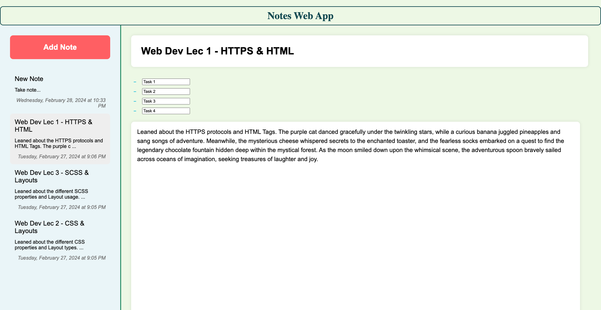

# Notes Web App

Welcome to Assignment 6 of the HTML CSS & JS project! In this assignment, we'll be developing a web app based on the requirements given below. Additionally, we'll be converting all CSS to SCSS syntax and organizing it into modular files. The goal is to learn about JavaScript and how it can be used in the application to add behavior to a static HTML page. Using JS, we have achieved to manage meeting notes efficiently with features such as viewing existing notes, expanding note details, editing notes, and adding new notes.

## Installing Sass Package Locally <a href="https://sass-lang.com/install/">(click here!)</a>

Sass can be installed locally in the project directory itself, allowing you to manage dependencies more efficiently and ensuring consistency across different environments.

### Procedure for Installing Sass Locally:

1. **Initialize Node.js project:**
    If you haven't already, navigate to your project directory in the terminal or command prompt and initialize a Node.js project by running the following command:

    ```
    npm init
    ```

    This will create a `package.json` file in your project directory, which is used to manage dependencies.

2. **Install Sass as a Development Dependency:**
    Sass should be installed as a development dependency of your project. Run the following command in the terminal or command prompt to install Sass locally:

    ```
    npm install -save sass
    ```

3. **Verify Sass Installation:**
    After installing Sass, you can verify its installation by checking the `package.json` file or running the following command in the terminal or command prompt:

    ```
    npm list sass
    ```

    This command should display the installed version of Sass in your project directory.

4. **Compile Sass to CSS:**
    Once Sass is installed locally in your project, you can start using it to compile Sass files (`.scss` or `.sass`) into CSS. You can create a script in the `package.json` file to compile Sass files. For example:

    ```json
    "scripts": {
        "sass-dev": "npx sass scss/main.scss dist/main.css --watch",
        "sass-prod": "npx sass scss/main.scss dist/main.css --style compressed",
        "sass": "npx sass scss/main.scss dist/main.css"
    }
    ```

    You can then run the script in the terminal or command prompt using the following command:

    ```
    npm run sass
    ```

    ## Development

    Run `npm run sass-dev` command in the terminal for building the CSS and the built CSS will be available under `dist/`. This command also watches the changes and continuously rebuilds the CSS.

    ## Production

    Run `npm run sass-prod` command in the terminal for building the CSS and the built CSS will be available under `dist/`. The built CSS will be minified.

## Hope you were able to install and run the SASS package successfully. Now let's talk about the assignment below:

## User Requirements

1. **View Existing Notes**: Users can see all existing notes fetched from a JSON file using XMLHttpRequest.

2. **List View**: Notes are displayed in a list view with titles and truncated content, showing a maximum of 10 words followed by "...". This is achieved using CSS.

3. **Expand Note Content**: Users can click on a note to expand its content, with CSS transitions for smooth animation.

4. **Expanded View**: In the expanded view, users can see the full content of the note, including the title, content, and a list of action items.

5. **Action Items**: Each action item has a checkbox to toggle between open and completed states.

6. **Edit Note**: Users can edit the content and action items directly in the expanded view.

7. **Add New Note**: Users can add a new note by clicking a create button, which opens an editable card with note details. The created field is automatically populated with the current date and time.

## Implementation

The application consists of HTML, CSS, and JavaScript files:

- **HTML Structure**: The `index.html` file contains the basic structure of the application, including elements for displaying notes and adding new notes.

- **CSS Styles**: The `styles.css` file contains styles for formatting and styling the application's appearance. It includes rules for truncating note content and transitions for animation effects.

- **JavaScript Logic**: The `main.js` file is the application's entry point, initializing the `App` class to manage notes, handle user interactions, and coordinate data display. `NotesAPI.js` provides essential utilities for managing note data, abstracting local storage operations and data fetching complexities. `NotesView.js` acts as the interface hub, constructing UI elements, managing user inputs, and updating displays. Together, these files ensure seamless operation, efficient data management, and clear presentation, enhancing the application's robustness and maintainability.

## Usage

1. **Viewing Existing Notes**: Upon opening the application, existing notes will be displayed in the list view.

2. **Expanding Note Content**: Click on a note to expand its content and view the full details.

3. **Editing Note**: In the expanded view, edit the content and action items as needed.

4. **Adding New Note**: Click the Add note button to add a new note. Enter the title, content, and action items.

## SCSS Conversion

All CSS code will be converted to SCSS syntax. The SCSS will be organized into multiple files based on UI features, common elements, and themes. This modular approach will help in maintaining and scaling the CSS codebase efficiently.

### SCSS Features Utilized:

- **Variables**: Used for defining reusable values such as colors, font sizes, etc. Variables are declared in the file present in `scss/_variables.scss`.

- **Mixins**: Employed for reusable blocks of styles that can be included across different selectors. Mixins are declared in the file present in `scss/_mixins.scss`.

- **Inheritance**: Utilized to inherit styles from one selector to another.

- **Control Statements**: Employed for conditional styling based on certain criteria.

- **Functions and Operators**: Used for performing operations and calculations within stylesheets. Functions are declared in the file present in `scss/_functions.scss`.

## Implementation Details

All SCSS code will be organized into modular files as follows:

- Variables: `scss/_variables.scss`
- Mixins: `scss/_mixins.scss`
- Layouts: `scss/_layouts.scss`
- Fonts: `scss/_fonts.scss`
- Functions: `scss/_functions.scss`

The use of these files will ensure a structured and maintainable SCSS codebase, allowing for easy customization and scalability.

- The navbar is fixed on the viewport using CSS positioning.
- JavaScript is not used.
- Table elements will not be used for formatting.
- Code documentation is added using SCSS comments for better code understanding and maintainability.



## Conclusion

The meeting notes application adeptly meets user requirements, enabling efficient note management. Leveraging JavaScript and CSS, users seamlessly view, expand, edit, and add notes. Utilizing XMLHttpRequest, existing notes are dynamically fetched from a JSON file, ensuring real-time access to data. Through intuitive design and user-centric features, the application enhances productivity and organization during meetings. With a focus on simplicity and functionality, the meeting notes application serves as a valuable tool for tracking discussions, action items, and essential details. Overall, it embodies effective note-taking practices, facilitating collaboration and effective communication.

Thank you for your participation and dedication to learning web development! If you have any questions or need further assistance, feel free to reach out. Happy coding!

## Submitted By
###     Aaditya Kasbekar
